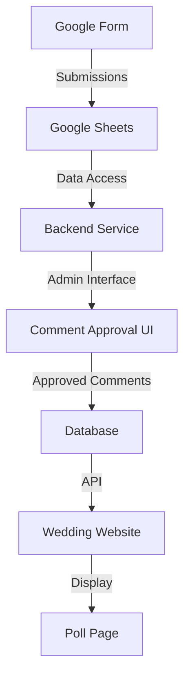
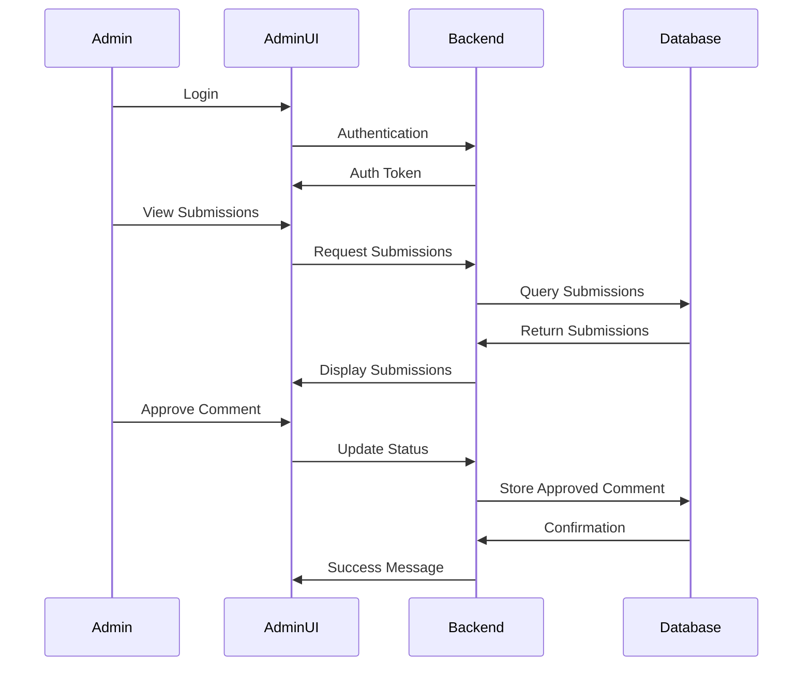
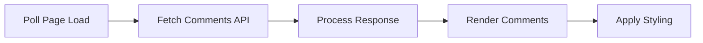

# Google Form Comments Implementation Plan

## Overview

This document outlines the plan for implementing a system to display manually approved comments from Google Form submissions on the wedding poll page.

## 1. Google Form Modifications

First, ensure your Google Form collects the necessary information:

- Add a "Name" field (if not already present)
- Ensure submission timestamps are captured
- Consider adding a "Display publicly?" checkbox for initial consent

## 2. Backend Implementation

We'll create a simple backend service to:
- Retrieve form submissions
- Provide an approval interface
- Store approved comments
- Serve approved comments via API



### 2.1 Backend Technology Options

1. **Google Apps Script + Google Sheets**
   - Use Google Sheets as a database
   - Create Apps Script to handle approvals and serve data
   - Pros: Tight integration with Google Forms, no additional hosting
   - Cons: Limited customization, potential performance issues

2. **Lightweight Backend Service**
   - Use a service like Firebase, Netlify Functions, or Vercel Serverless Functions
   - Store data in a database like Firebase Firestore
   - Pros: More powerful, better separation of concerns
   - Cons: Requires additional setup and hosting

3. **Custom API Server**
   - Build a dedicated API server (Node.js, Python, etc.)
   - Use a database like MongoDB or PostgreSQL
   - Pros: Maximum flexibility and control
   - Cons: Most complex to set up and maintain

## 3. Admin Interface

Create a simple admin interface to:
- View all submissions
- Approve/reject comments
- Edit comments if needed
- Manage the display order



## 4. Frontend Implementation

Modify the poll.html page to display approved comments:



### 4.1 HTML Structure

Add a new section to poll.html to display the comments:

```html
<!-- Comments Section -->
<section class="section">
  <div class="container">
    <h2 class="section__title">What Others Are Saying</h2>
    
    <div class="comments-container">
      <!-- Comments will be loaded here dynamically -->
      <div id="comments-list" class="comments-list">
        <!-- Loading placeholder -->
        <p class="comments-loading">Loading comments...</p>
      </div>
    </div>
  </div>
</section>
```

### 4.2 JavaScript Implementation

Add functionality to fetch and display comments:

```javascript
/**
 * Comments Functionality
 */
function initComments() {
  const commentsContainer = document.getElementById('comments-list');
  
  if (!commentsContainer) return;
  
  // Fetch comments from API
  fetchComments()
    .then(comments => {
      renderComments(comments, commentsContainer);
    })
    .catch(error => {
      commentsContainer.innerHTML = `<p class="comments-error">Unable to load comments. ${error.message}</p>`;
    });
}

/**
 * Fetch comments from the API
 */
async function fetchComments() {
  const response = await fetch('https://your-backend-url.com/api/comments');
  
  if (!response.ok) {
    throw new Error('Failed to fetch comments');
  }
  
  return await response.json();
}

/**
 * Render comments in the container
 */
function renderComments(comments, container) {
  if (!comments || comments.length === 0) {
    container.innerHTML = '<p class="comments-empty">No comments yet. Be the first to share your thoughts!</p>';
    return;
  }
  
  const commentsHTML = comments.map(comment => `
    <div class="comment-card">
      <div class="comment-header">
        <h3 class="comment-author">${comment.name}</h3>
        <span class="comment-date">${formatDate(new Date(comment.timestamp))}</span>
      </div>
      <div class="comment-body">
        <p>${comment.text}</p>
      </div>
    </div>
  `).join('');
  
  container.innerHTML = commentsHTML;
}
```

### 4.3 CSS Styling

Add styles for the comments section:

```css
/* Comments Section */
.comments-list {
  display: flex;
  flex-direction: column;
  gap: var(--spacing-md);
}

.comment-card {
  background-color: var(--color-white);
  border-radius: var(--border-radius);
  box-shadow: var(--box-shadow);
  padding: var(--spacing-md);
  border-left: 3px solid var(--color-teal);
}

.comment-header {
  display: flex;
  justify-content: space-between;
  align-items: center;
  margin-bottom: var(--spacing-sm);
}

.comment-author {
  font-family: var(--font-heading);
  color: var(--color-teal);
  margin: 0;
  font-size: 1.2rem;
}

.comment-date {
  font-size: 0.9rem;
  color: #777;
}

.comment-body p {
  margin-bottom: 0;
}

.comments-loading,
.comments-error,
.comments-empty {
  text-align: center;
  padding: var(--spacing-md);
}

.comments-error {
  color: #d9534f;
}
```

## 5. Backend API Endpoints

Create the following API endpoints:

1. `GET /api/comments` - Retrieve approved comments
2. `GET /api/admin/submissions` - Get all submissions (admin only)
3. `POST /api/admin/approve/:id` - Approve a comment (admin only)
4. `POST /api/admin/reject/:id` - Reject a comment (admin only)
5. `PUT /api/admin/comments/:id` - Edit a comment (admin only)
6. `DELETE /api/admin/comments/:id` - Delete a comment (admin only)

## 6. Security Considerations

1. Implement authentication for the admin interface
2. Use HTTPS for all API requests
3. Implement rate limiting to prevent abuse
4. Sanitize user input to prevent XSS attacks
5. Set up proper CORS configuration

## 7. Implementation Phases

### Phase 1: Setup and Infrastructure
- Modify Google Form to collect required information
- Set up backend service and database
- Create basic API endpoints

### Phase 2: Admin Interface
- Build admin authentication
- Create submission review interface
- Implement approval/rejection functionality

### Phase 3: Frontend Integration
- Add comments section to poll.html
- Implement comment fetching and rendering
- Style the comments section

### Phase 4: Testing and Refinement
- Test the entire flow from submission to display
- Gather feedback and make improvements
- Implement any additional features